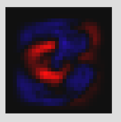

# Naz Malik

[Projects](#projects) | [Side-Projects](#side-projects) | [Skills](#skills) | [Experience](#experience) | [Education](#education) | [Coding Blog on Medium](http://www.medium.com/@nazwhale)
***

### About Me

Previously a music writer and journalist, last summer I had an idea for a learning application. After obsessively designing the user-experience, I wanted the power to make my idea a reality. I became curious about coding and realised there was a world of things I'd be able to make if I had the skills.

I’m now a developer who spends his spare time going to meet-ups and conferences, [writing a prizewinning coding blog](http://www.medium.com/@nazwhale), reading tech articles, and using words like 'dope!' and 'stoked!' about VR, bots ([here's one I made earlier](https://twitter.com/thenazbot/with_replies)), and neural networks. Coding has taken over my life. I still can't quite believe it.

Since learning to code at Makers Academy (a 12-week bootcamp), I was hired within a week (see [Experience](#experience)), have given a number of [lightning talks](https://medium.com/@nazwhale/the-hole-in-my-pocket-c09458178932) around London, and have taught at [CodeBar](http://codebar.io/). In September, I organised and ran an [event](https://www.eventbrite.co.uk/e/snakers-academy-build-a-game-in-3-hours-with-makers-academy-tickets-36829788890) to teach 35 programming newcomers how to code the retro game 'snake'.

Currently I'm looking for a career in London as a full-stack developer, in an ambitious company working at the top of their field. Working on a product that I can get excited about is crucial, as is working in a team that will support me in learning new skills.

When I'm in an intellectually stimulating environment, working for a cause I believe in, I'm extremely motivated and productive.

**A word from my coach at Makers Academy:**
"Naz is one of the most impressive individuals I have seen go through the course. Within a weekend of me helping him get set up with Vim he was teaching me new things, I've seen him inspire other members of his cohort to push themselves and his desire to learn and grow is astounding, and I've been continually impressed by his creativity and passion for new technologies. He is also a damn good egg 🥚 👍"

**And from Makers' head of marketing, who helped me organise ['Snakers Academy'](https://www.eventbrite.co.uk/e/snakers-academy-build-a-game-in-3-hours-with-makers-academy-tickets-36829788890):**
"I was impressed with how well organised Naz was in creating the materials for the event, as well as how seamlessly and naturally he worked with my team to ensure we had a high number of signups (which we did - in fact, it was a record for a 'learn to code' event). Naz lead the entire event, teaching over 30 beginners (with varying ability levels), empathising with those that were struggling, keeping the 'fast learners' entertained, and generally making sure that all attendees had a great time and learnt a tonne, all while keeping a smile on his face and a positive, empowering tone to the event.

Naz is flexible, hard working, kind, resourceful, empathic, a great communicator, and more than any of this - the sort of person you'd want on your team."

**Tech Skills:** TDD, Pair-Programming, Agile, XP Values, Vim Ninja

***

## <a name="projects">Projects</a>

|     GitHub Repo  |  Description  | Technologies | Blog Post |
|--------------|---------------|--------------|------------|
|  [Spaceship](https://github.com/nazwhale/spaceship)   |  I'm very proud of this project. Integrating virtual reality with Amazon's Alexa seemed like a mad mission for group of 10-week-old devs, but we made it work, learnt a ton (specifically regarding groupwork, cloud services, and programming for VR), and even implemented a couple of extra features. See the repo for our daily "Log Book".    | JavaScript, Node.js, Jasmine, A-Frame, Firebase, Alexa & AWS Lambda        | Coming soon... |
|  [Gilded Rose](https://github.com/nazwhale/GildedRose-Refactoring-Kata)   |  A task to refactor a poor piece of programming. Despite being a small project, I'm proud of the cleanliness and testability of my code. It was really satisfying to realise how far I've come in terms of object-oriented programming and test-driven development. | Ruby, RSpec          | N/A |
|  [Number Identifier](https://github.com/nazwhale/playing-with-tensorflow)   |  A convolutional Neural Network that learnt how to identify hand-written digits with 98% accuracy. This was meant to be part of a larger group project that never got finished, so I've linked the repo in which the Tensorflow experiments took place.          | Python, Tensorflow          | [Neural Network in a Week](https://medium.com/@nazwhale/neural-network-in-a-week-3ef84175191b) |
|   [PoochPads](https://github.com/kittysquee/poochpads)     |  An AirBnB-style bookings app for dog-owners, and my first collaborative project. We learnt a lot about collaberating with Git, and well as delegating features between us, having regular stand-ups, and working with XP values and Agile practices. |   Ruby, PostgreSQL, BCrypt, HTML, CSS, RSpec, Capybara         | [Team Time](https://medium.com/codewhale/team-time-6fa9a64d8282) |

Here's my neural network's representation of a 3 (kind of beautiful, no?):

## <a name="side-projects">Side-Projects</a>

Somehow I've ended up with a ridiculous amount of weird coding experiments from my weekends at Makers. Here are a few of the most coherent:
- NazBot
  - A Twitter Bot using the Guardian's API to reply to tweets with relevant news stories ([Give it a go!](https://twitter.com/thenazbot/with_replies))
  - [Repo](https://twitter.com/thenazbot/with_replies)
  - [Blog Post](https://medium.com/codewhale/on-rails-9346ab7a56b9)
- Star Wars Facts
  - A skill for Amazon's Alexa, now [published on the US skills store](https://www.amazon.com/dp/B0725WTNWZ/ref=sr_1_1?s=digital-skills&ie=UTF8&qid=1495642862&sr=1-1&keywords=star+wars+facts)
  - I adapted a tutorial directly into AWS Lambda one Sunday afternoon, so unfortunately there's no repository on GitHub (yet)
- Dusty
  - A featherweight testing framework for JavaScript. It only has 3 matchers, and, though I realise this might be excessively featherweight, it was fun to make and pleasing to publish
  - [Repo](https://github.com/nazwhale/dusty)
  - [Blog Post](https://medium.com/@nazwhale/diving-deeper-a6e519c21ab)
  - It's [published to NPM](https://www.npmjs.com/package/dusty-testing). People are downloading it!

***
## <a name="skills">Skills</a>

**Creativity**

In the last month at Makers Academy, from a group of 24, I came up with a quarter of the democratically chosen ideas for the practice and final projects.

Furthermore, I was chosen for a highly competitive dissertation project at UCL specifically for my ability to generate ideas. I put this into use by coming up with a piece of original research and rigorously designing an experiment.

In my own time I've written a bunch of songs, composed music for an animation, and am currently working on a novel.

**Communication**

I believe that the ability for a developer to communicate their code to others is crucial. As a result, I've paid close attention the way in which I articulate my code when pair-programming and working in groups, a feature of my life as a developer. I've put this into practice by teaching HTML and CSS to beginners at [Codebar](https://codebar.io/). Additionally, I've strived to improve my written communication skills by [blogging](http://www.medium.com/@nazwhale) about my experience learning to code weekly.

For two years I was a freelance writer, having my work published online at Canvas and Music is My Sanctuary, as well as published in print for Middlesex University. I learned to adapt my writing for different audiences, crafting my style for their specific requirements. I was obsessive about improving my skills. I hope my writing skills will be useful in crafting high quality documentation as a developer.

Since leaving university I've lived in 5 countries, each for more than 3 months. From this experience I became comfortable communicating with people from a diverse range of backgrounds.

**Logical/Analytical Thinker**

Logical thinking has always been my strong point - throughout school, I consistently achieved my highest grades in Maths and Sciences. Additionally, I am a keen chess player.

Later, I learned to critique experimental designs and evaluate academic literature as a fundamental part of my degree in Experimental Psychology. In learning to code, the opportunity to flex my logical thinking muscles once again has been hugely enjoyable and rewarding.

***

## <a name="experience">Experience</a>

#### Work Experience

**Full-Stack Developer - Comsec Investigations** (June '17 - present)
Technologies used include C#, ASP.NET, JavaScript, SQL, and AWS (Lamdba, S3, Step Functions).

In my first few months I've written a significant amount of production code and have become comfortable with a new programming language (C#). I've also introduced regular feedback sessions with my team in an attempt to improve our communication. 

**Freelance Writer - Various** (May '16 to February '17)
Writing reports, online music journalism, and copywriting for various companies to fund a globetrotting lifestyle for 2 years after university.

**Investigative Journalist - Ecostorm** (August '15 to May '16)
Researching companies violating human and animal rights and compiling reports. I also conducted undercover fieldwork using hidden cameras.

**Research Assistant - University College London** (July to September '14)
Assisted with the running of experiments at the Psychopharmacology lab.

#### Life Experience

After my degree, I made the decision to travel the world whilst financially supporting myself from my laptop. I found several freelance writing jobs and spent 2 years living and working in Morocco, Sri Lanka, Colombia, Guatemala, and China.

While traveling, I always tried to keep learning.
Here are some things I can do, which I couldn't when I graduated:

- Discipline myself as a freelancer
- Copywrite professionally with impeccable grammar
- Speak Spanish at a strong intermediate level
- Fly a paraglider (achieved private license)
- Touch my toes (3 months kung-fu study in China)

***

## <a name="education">Education</a>

#### Makers Academy (March to June '17)

I learnt to code at [Makers Academy](http://www.makersacademy.com/), a highly-selective software development bootcamp in London. Their “Oxbridge meets the Royal Marines for developers” environment has transformed me from a writer to a self-sufficient and enthusiastic developer.

#### University College London (September '11 to July '14)

- BSc Experimental Psychology
  - High 2:1 grade
  - High 1st in dissertation

#### Reigate Grammar School (September '03 to July '10)

- A-Levels
  - Mathematics - A*
  - Economics - A
  - Geography - A
  - History - A
